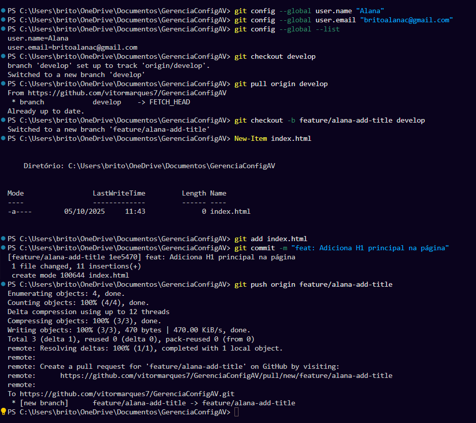

# RELATÓRIO DE PROJETO – Estratégias de Branching em Git

## Identificação
- **Integrantes da equipe**:
  - João Vitor dos Santos Marques
  - Alana Brito
  - Letícia Oliveira
- **Repositório GitHub**: [https://github.com/vitormarques7/GerenciaConfigAV.git](https://github.com/vitormarques7/GerenciaConfigAV.git)

---

## 1. Estrutura Inicial
- Branch principal `main` criada e configurada.
- Branch `develop` criada a partir de `main`.
- Configuração inicial feita com os comandos:
  ```bash
  git init
  git checkout -b main
  git checkout -b develop main
  git push -u origin main
  git push -u origin develop
  ```

---

## 2. Fase 1 – Git Flow

### 2.1 Features
- **Branches criadas:**
  - `feature/vitor-add-html` – adiciona estrutura base do `index.html`
  - `feature/vitor-add-header` – adiciona `<header>` no `index.html`
  - `feature/alana-add-title` – adiciona `<h1>` principal no `index.html`
  <details>
    <summary>Clique para ver o print do commit</summary>
    
  </details>
  - `feature/alana-add-css` – adiciona arquivo `style.css`
  - `feature/leticia-add-footer` – adiciona `<footer>` no `index.html`
  - `feature/leticia-update-readme` – preenche nomes no `README.md`
- Todos os commits foram registrados e enviados para o remoto.

### 2.2 Conflitos
- Conflito ocorreu no arquivo `index.html` durante o merge da `feature/alana-add-title` na `develop`.
- Marcadores de conflito visualizados e resolvidos manualmente.
  
  **Print do conflito:**
  

  **Print após resolução:**
  

- Commit da resolução:
  ```bash
  git add index.html
  git commit -m "fix: Resolve conflito de merge no titulo do index.html"
  git push origin develop
  ```

### 2.3 Release
- Criada branch `release/2.0` a partir da `develop`.
- Adicionado arquivo `VERSION.txt` com conteúdo `2.0`.
- Merge em `main` e `develop` concluído.
- Tag criada:
  ```bash
  git tag -a v2.0 -m "Release da versão 2.0"
  git push origin v2.0
  ```

### 2.4 Hotfix
- Criado `hotfix/2.0.1` para corrigir estrutura do relatório e adicionar nomes da equipe.
- Merge do hotfix feito em `main` e `develop`.
- Tag criada:
  ```bash
  git tag -a v2.0.1 -m "Correção crítica 2.0.1"
  git push origin v2.0.1
  ```

### 2.5 Uso de Rebase
- Aplicado rebase na branch `feature/leticia-add-footer`.
- Foram unificados dois commits (feat + fix) em apenas um:
  ```bash
  git rebase -i HEAD~2
  ```
- O histórico ficou mais limpo e linear após o `squash`.

---

## 3. Fase 2 – Trunk-Based Development

### 3.1 Branches Curtos
- Criadas diretamente da `main`:
  - `vitor-task-1` – 1 commit (arquivo `about.html`)
  - `alana-task-2` – 2 commits (arquivo `contact.html`)
  - `leticia-task-3` – 1 commit (arquivo `services.html`)

### 3.2 Squash
- Merge da branch `alana-task-2` feito com squash:
  ```bash
  git merge --squash alana-task-2
  git commit -m "feat: Implementa página de contato com estilos"
  ```
- Squash usado para manter histórico da `main` limpo, condensando commits pequenos em um só.

### 3.3 Tag Final
- Tag criada para a versão final:
  ```bash
  git tag -a v3.0 -m "Release da versão 3.0 – Trunk-Based"
  git push origin v3.0
  ```

---

## 4. Histórico de Commits
Saída do comando:
```bash
git log --oneline --graph --all
```
*   244d13f (HEAD -> main, origin/main, origin/HEAD) Merge branch 'main' of https://github.com/vitormarques7/GerenciaConfigAV
    |\  
    | * 442851a docs: adiciona o link do repositório no RELATORIO.md
* | 14553d8 docs: Preenche as partes direcionadas a Letícia
  |/
* 0d9e9f4 docs: Adiciona estrutura ao RELATORIO.md
* 3920877 docs: Adiciona imagens para o relatório
* c3fbd71 (tag: v3.0) feat: Implementa página de contato com estilos
*   094db36 Merge branch 'leticia-task-3'
    |\  
    | * 23dfbea (origin/leticia-task-3) feat: Adiciona página de serviços
* |   50f36a9 Merge branch 'vitor-task-1'
  |\ \  
  | * | 3c5e886 (origin/vitor-task-1, vitor-task-1) feat: Adiciona página sobre
  |/ /  
  | | * 42b78c6 (origin/alana-task-2, alana-task-2) refactor: Move contact.html para o diretório src
  | | * e3d8010 style: Ajusta espaçamento na página de contato
  | | * 794e458 feat: Adiciona página de contato
  | |/  
  |/|
* |   4836cb3 (tag: v2.0.1) Merge remote-tracking branch 'origin/hotfix/2.0.1'
  |\ \  
  | | | *   e7d5bf9 (origin/develop, develop) Merge remote-tracking branch 'origin/hotfix/2.0.1' into develop
  | | | |\  
  | | |_|/  
  | |/| |   
  | * | | a86ff81 (origin/hotfix/2.0.1, hotfix/2.0.1) fix(docs): Ajusta relatório ao modelo da atividade e adiciona integrantes
  |/ / /
* | |   7e0b185 (tag: v2.0) feat: Finaliza release 2.0 e integra na main
  |\ \ \  
  | |/ /  
  |/| |
* | | 4164c53 fix: Atualiza nome da equipe no footer
* | | a646ebb feat: Adiciona footer na página
  | | *   3a0be6c Merge branch 'release/2.0' into develop
  | | |\  
  | | |/  
  | |/|   
  | * | ec9edaf (origin/release/2.0, release/2.0) chore: Atualiza a versão para 2.0
  | |/  
  | *   350c604 feat: Integra feature de footer e resolve conflitos
  | |\  
  | | * 668e173 (origin/feature/leticia-add-footer) feat: Adiciona e ajusta footer da página
  | * |   e7d90d0 fix: Resolve conflito ao integrar header da branch feature/vitor-add-header
  | |\ \  
  | | * | 0c89883 (origin/feature/vitor-add-header, feature/vitor-add-header) feat: Adiciona header na página inicial
  | * | |   42e9b8a Merge remote-tracking branch 'origin/feature/leticia-update-readme' into develop
  | |\ \ \  
  | * \ \ \   9524573 Merge branch 'feature/alana-add-css' into develop
  | |\ \ \ \  
  | | * | | | c0135bb (origin/feature/alana-add-css, feature/alana-add-css) feat: Adiciona arquivo de estilo CSS básico
  | |/ / / /  
  |/| | | |   
  | * | | |   bf1a8a5 fix: Resolve conflito de merge no titulo do index.html
  | |\ \ \ \  
  | | * | | | 2453376 (origin/feature/alana-add-title, feature/alana-add-title) feat: Adiciona H1 principal na página
  | |/ / / /  
  |/| | | |   
  | * | | | e7bd767 Merge branch 'feature/vitor-add-html' into develop
  |/| | | |
  | | |/ /  
  | |/| |   
  | * | | 2234fde (origin/feature/vitor-add-html, feature/vitor-add-html) feat: Adiciona estrutura base do index.html
  |/ / /  
  | | | * 5bdfd4a (origin/feature/leticia-update-readme, feature/leticia-update-readme) docs: Preenche nomes da equipe no RELATORIO
  | | |/  
  | | * 810914b fix: Atualiza nome da equipe no footer
  | | * 7ea6da0 feat: Adiciona footer na página
  | |/  
  | * 8e4ac0a docs: Preeche nomes da equipe em RELATORIO
  |/
* 28f90da chore: adicionar .gitignore na raiz
* 0c33e20 configurações iniciais
* 62bfb2a feat: adicionar RELATORIO inicial
  (END)

**Em Captura de Tela:**


---

## 5. Reflexão Final

Neste projeto, testamos o Git Flow e o Trunk-Based Development. Para o nosso time e para um trabalho rápido como este, o Trunk-Based (da Fase 2) foi bem mais eficiente. O processo de criar branches curtas direto da main foi mais rápido e com menos complicação, o que agilizou bastante o nosso trabalho.

Já o Git Flow (da Fase 1), apesar de ser muito seguro, pareceu complexo demais para o que precisávamos. Ter que gerenciar tantas branches (feature, release, hotfix) exigiu mais cuidado e gerou algumas dúvidas no começo, principalmente com arquivos que dependiam do trabalho de outro colega.

Nossa conclusão é que a melhor estratégia depende do projeto. O Git Flow é excelente para projetos grandes e com muitas regras, mas para o nosso caso, a simplicidade e a velocidade do Trunk-Based foram a melhor escolha.